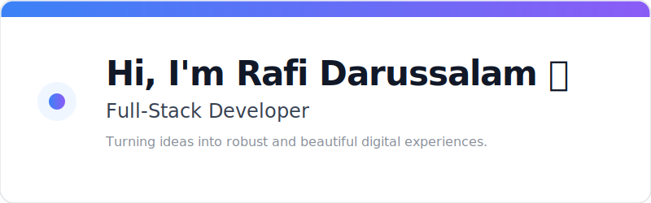

  

---

  <h3>About Me</h3>
  
I am Rafi Darussalam, a developer specializing in modern web technologies. I focus on creating clean, efficient, and scalable applications.

  <h3>Tech Stack & Tools</h3>

  
  
  
  

 

  
  
  

 

  <h3>Get In Touch</h3>
  

