  

  

  

 

<!-- ═══════════════════════════════════ TECH STACK ═══════════════════════════════════ -->

 

<!-- ── Frameworks & Libraries ── -->

  

  <!-- Next.js — branded -->
  &nbsp;
  <!-- Laravel — branded -->
  &nbsp;
  <!-- React — branded -->
  &nbsp;
  <!-- Vite — branded -->
  &nbsp;
  <!-- Tailwind CSS — branded -->
  &nbsp;
  <!-- Framer Motion — branded -->
  

 

<!-- ── Languages ── -->

  

  <!-- HTML — monochrome -->
  &nbsp;
  <!-- CSS — monochrome -->
  &nbsp;
  <!-- JavaScript — monochrome -->
  &nbsp;
  <!-- TypeScript — monochrome -->
  &nbsp;
  <!-- PHP — monochrome -->
  

 

<!-- ── Tools ── -->

  

  <!-- Node.js — branded -->
  &nbsp;
  <!-- pnpm — branded -->
  

 

 

<!-- ═══════════════════════════════════ GITHUB ANALYTICS ═══════════════════════════════════ -->

  

<!-- Stats + Streak side by side -->

  
  &nbsp;
  

<!-- Top Languages -->

  

 

 

<!-- ═══════════════════════════════════ TROPHIES ═══════════════════════════════════ -->

  

  

 

 

<!-- ═══════════════════════════════════ ACTIVITY GRAPH ═══════════════════════════════════ -->

  

  

 

<!-- Snake animation -->

  <picture>
    <source media="(prefers-color-scheme: dark)" srcset="https://raw.githubusercontent.com/Rafi-Darussalam/Rafi-Darussalam/output/github-snake-dark.svg" />
    <source media="(prefers-color-scheme: light)" srcset="https://raw.githubusercontent.com/Rafi-Darussalam/Rafi-Darussalam/output/github-snake.svg" />
    
  </picture>

 

<!-- ═══════════════════════════════════ FOOTER ═══════════════════════════════════ -->

  

